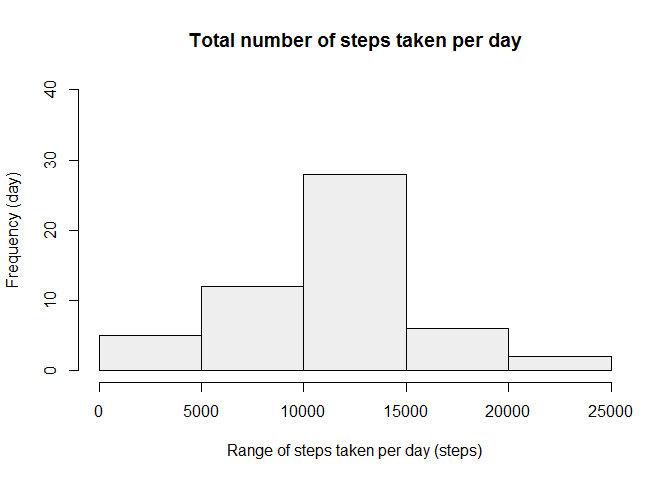
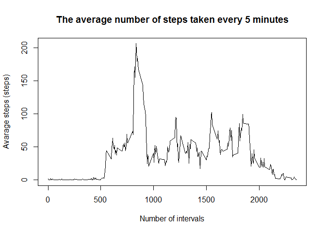
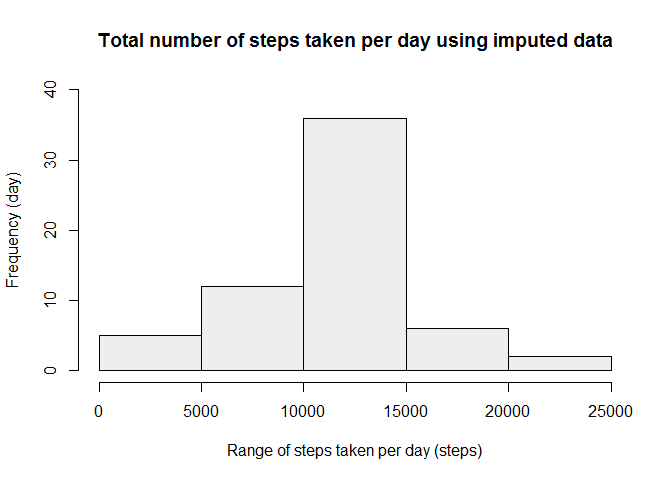
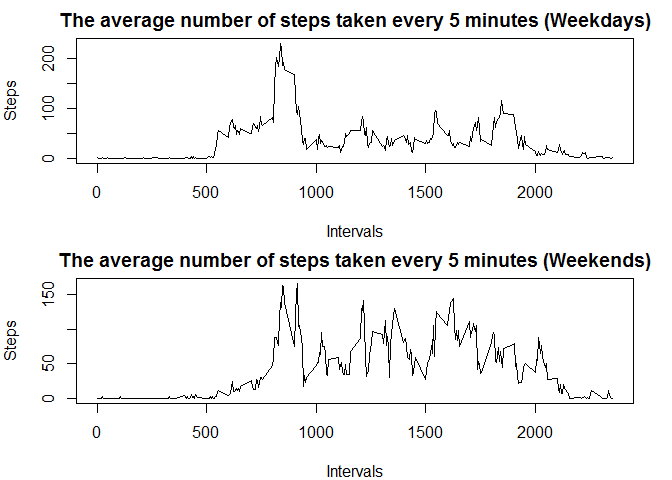

# Reproducible Research: Peer Assessment 1


## Loading and preprocessing the data

```r
    # Read data with read.csv(). 
    activity <- read.csv("activity/activity.csv")
```

## What is mean total number of steps taken per day?
Calculate the total number of steps taken per day

```r
    # Compute total steps per day.
    total <- NULL
    dates <- unique(activity$date)
    for(i in dates){
        date_i <- activity[activity$date == i,]
        total  <- rbind(total, data.frame(i, sum(date_i$steps)))
    }
    names(total) <- c("date", "steps")
    
    # Remove NA here
    total <- total[!is.na(total$steps),]
    
    # Plot histgram
    hist(total$steps,
         main = "Total number of steps taken per day",
         xlab = "Range of steps taken per day (steps)",
         ylab = "Frequency (day)",
         ylim = c(0,40),
         col  = c("#eeeeee"))
```

 

Calculate and report the mean and median of the total number of steps taken per day

**Mean of the total number of steps taken per day** 

```r
    # Compute mean of steps per day.
    mean(total$steps)
```

```
## [1] 10766.19
```
**Median of the total number of steps taken per day** 

```r
    # Compute median of steps per day.
    median(total$steps)    
```

```
## [1] 10765
```


## What is the average daily activity pattern?

```r
    # Remove NA first
    rm_na_data <- activity[!is.na(activity$steps), ]
    
    # Create data frame to analysis the data set.
    time_series   <- NULL
    interval_list <- unique(rm_na_data$interval)
    for(i in interval_list){
        mean_steps  <- mean(rm_na_data[rm_na_data$interval == i,"steps"])
        time_series <- rbind(time_series, data.frame(i, mean_steps))
    }
    names(time_series) <- c("interval", "steps")

    plot(time_series$interval, # x axis value
         time_series$steps,    # y axis value
         type ="l",
         main = "The average number of steps taken every 5 minutes",
         xlab = "Number of intervals",
         ylab = "Avarage steps (steps)")
```

 

Which 5-minute interval, on average across all the days in the dataset, contains the maximum number of steps?

```r
    max_steps <- max(time_series$steps)
    time_series[time_series$steps == max_steps, "interval"]
```

```
## [1] 835
```

## Imputing missing values
Calculate and report the total number of missing values in the dataset (i.e. the total number of rows with NAs)

```r
    sum(is.na(activity["steps"]))
```

```
## [1] 2304
```

Devise a strategy for filling in all of the missing values in the dataset. The strategy does not need to be sophisticated. For example, you could use the mean/median for that day, or the mean for that 5-minute interval, etc.

```r
    # Create new data sets whose Na values will be filled.
    imputed_data <- activity
    
    # Prepare NA removed data
    rm_na_data <- imputed_data[!is.na(imputed_data$steps), ]
    
    # Replace Na with avarage steps by scanning each row. 
    rows <- 1:nrow(imputed_data)
    for(i in rows){
        
        # If ith row contains Na in "steps", replace it with avarage
        if(is.na(imputed_data[i,"steps"])){
            detect_na   <- rm_na_data$interval == imputed_data[i,"interval"]
            mean_steps  <- mean(rm_na_data[detect_na,"steps"])
            imputed_data[i,"steps"] <- mean_steps
        }
    }
```

Make a histogram of the total number of steps taken each day and Calculate and report the mean and median total number of steps taken per day. Do these values differ from the estimates from the first part of the assignment? What is the impact of imputing missing data on the estimates of the total daily number of steps?

```r
    # Compute total steps per day.
    total <- NULL
    dates <- unique(imputed_data$date)
    for(i in dates){
        date_i <- imputed_data[imputed_data$date == i,]
        total  <- rbind(total, data.frame(i, sum(date_i$steps)))
    }
    names(total) <- c("date", "steps")
    
    # Plot histgram
    hist(total$steps,
         main = "Total number of steps taken per day using imputed data",
         xlab = "Range of steps taken per day (steps)",
         ylab = "Frequency (day)",
         ylim = c(0,40),
         col  = c("#eeeeee"))
```

 

**Mean of the total number of steps taken per day** 

```r
    # Compute mean of steps per day.
    mean(total$steps)
```

```
## [1] 10766.19
```
**Median of the total number of steps taken per day** 

```r
    # Compute median of steps per day.
    median(total$steps)    
```

```
## [1] 10766.19
```
## Are there differences in activity patterns between weekdays and weekends?
Create a new factor variable in the dataset with two levels - "weekday" and "weekend" indicating whether a given date is a weekday or weekend day.

```r
    # Create lists which indicate weekdays and weekends
    weekdays_list = c("Monday", "Tuesday", "Wednesday", "Thursday", "Friday")
    weekends_list = c("Saturday", "Sunday")
    
    # Copy imputed data to new data frame with weekday/weekend information
    day_data <- imputed_data
    
    # Add weekday/weekend info.
    days <- weekdays(as.Date(day_data$date))
    day_data[days %in% weekdays_list, "weekday_weekend"] <- "weekday"
    day_data[days %in% weekends_list, "weekday_weekend"] <- "weekend"

    # Convert weekday/weekend into factor
    day_data$weekday_weekend <- as.factor(day_data$weekday_weekend)
    
    # Create data frame to analysis the data set.
    time_series_weekdays <- NULL
    time_series_weekends <- NULL
    interval_list  <- unique(day_data$interval)
    
    for(i in interval_list){
        weekdays_steps <- day_data[day_data$interval == i & day_data$weekday_weekend == "weekday","steps"]
        weekends_steps <- day_data[day_data$interval == i & day_data$weekday_weekend == "weekend","steps"]
        
        mean_steps_weekdays  <- mean(weekdays_steps)
        mean_steps_weekends  <- mean(weekends_steps)
        
        time_series_weekdays <- rbind(time_series_weekdays, data.frame(i, mean_steps_weekdays))
        time_series_weekends <- rbind(time_series_weekends, data.frame(i, mean_steps_weekends))
    }
    
    names(time_series_weekdays) <- c("interval", "steps")
    names(time_series_weekends) <- c("interval", "steps")
```

Make a panel plot containing a time series plot (i.e. type = "l") of the 5-minute interval (x-axis) and the average number of steps taken, averaged across all weekday days or weekend days (y-axis). 

```r
    par(mfrow = c(2, 1), mar = c(4,4,2,2))
    
    plot(time_series_weekdays$interval, # x axis value
         time_series_weekdays$steps,    # y axis value
         type ="l",
         main = "The average number of steps taken every 5 minutes (Weekdays)",
         xlab = "Intervals",
         ylab = "Steps")
    
    plot(time_series_weekends$interval, # x axis value
         time_series_weekends$steps,    # y axis value
         type ="l",
         main = "The average number of steps taken every 5 minutes (Weekends)",
         xlab = "Intervals",
         ylab = "Steps")
```

 
